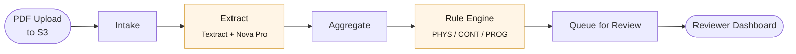

<div align="center">


<h1>Transcript Verification</h1>

<p>
  <strong>AI-assisted nursing transcript review for the Mississippi State Board of Nursing.</strong>
  <br/>
  Ingests transcript PDFs, extracts structured evidence with Amazon Bedrock and Textract,
  <br/>
  applies deterministic validation rules, and routes each application into a reviewer dashboard
  <br/>
  with full audit history.
</p>

<p>
  
  
  
  
</p>

</div>

> [!IMPORTANT]
> **Advisory only.** The system raises review flags and records reviewer actions.
> It does **not** make licensing decisions.

---

## Pipeline



Every step is a Lambda. Orchestration is AWS Step Functions; state lives in a single-table DynamoDB.

---

## Highlights

<table>
  <tr>
    <td width="33%" valign="top">
      <h4 align="center">Event-driven</h4>
      <p align="center"><sub>S3 upload kicks off an autonomous Step Functions pipeline. No polling, no queues to manage.</sub></p>
    </td>
    <td width="33%" valign="top">
      <h4 align="center">Evidence-backed</h4>
      <p align="center"><sub>Every extracted field carries source coordinates from Textract and a confidence score from Nova Pro.</sub></p>
    </td>
    <td width="33%" valign="top">
      <h4 align="center">Auditable</h4>
      <p align="center"><sub>Reviewer decisions, system events, and rule fires all land in DynamoDB as immutable audit entries.</sub></p>
    </td>
  </tr>
</table>

---

## Quick Start

**Prerequisites:** Python 3.11+, Node 20+, AWS CDK CLI

```bash
npm install -g aws-cdk
make install     # set up venvs and frontend deps
make test        # pytest suite (mocked AWS, no credentials needed)
make synth       # synthesize CloudFormation (no AWS calls)
```

Frontend dev loop:

```bash
cd frontend && npm run dev
```

> [!WARNING]
> Deploys are gated by [`DEPLOY_RUNBOOK.md`](DEPLOY_RUNBOOK.md).
> Never run `cdk deploy` without it.

---

## Architecture

<details>
<summary><strong>Pipeline (deployed scope: transcript-only)</strong></summary>

<br/>

1. **Upload** — reviewer uploads a PDF; frontend gets a presigned PUT URL from the dashboard API.
2. **Intake** (`services/intake/`) — S3 `ObjectCreated` event fires, writes a `METADATA` row to DynamoDB, and starts Step Functions.
3. **Extract** (`services/extract/`) — runs Textract (text, tables, forms, layout, queries, signatures), renders each page to PNG, and calls Bedrock Nova Pro per page with both image and Textract context.
4. **Aggregate** (`services/aggregate/`) — flattens per-page extraction into a single document. Highest-confidence value wins for scalars; arrays are merged.
5. **Rule Engine** (`services/rule_engine/`) — runs every `PHYS_*`, `CONT_*`, `PROG_*` rule and writes one `FLAG#{rule}#{seq}` item per flag.
6. **Queue for Review** (`services/notify/`) — marks the application `READY_FOR_REVIEW` and writes an audit event.

Cross-document and population-level checks (`services/cross_doc/`, `services/population_check/`) are stubs for future phases.

</details>

<details>
<summary><strong>Storage</strong></summary>

<br/>

Single-table DynamoDB (`msbn-applications`):

- `PK = APP#{applicationId}`, `SK` discriminates record type — `METADATA`, `DOCUMENT#{type}`, `FLAG#{rule}#{seq}`, audit events
- `GSI1-ReviewQueue` — drives the dashboard queue
- `GSI2-LicenseDedup`, `GSI3-InstitutionCluster` — defined for population checks, not yet exercised

S3 bucket is versioned, SSL-enforced, and retained on stack teardown. Layout: `uploads/`, `processed/{appId}/...`, `preview/`.

</details>

<details>
<summary><strong>CDK stacks</strong></summary>

<br/>

Four stacks deployed in dependency order:

| Stack | Resources | Depends on |
| --- | --- | --- |
| `MsbnStorageStack` | S3 bucket, DynamoDB table | — |
| `MsbnAuthStack`    | Cognito user pool + client | — |
| `MsbnComputeStack` | Lambdas, Step Functions | Storage |
| `MsbnApiStack`     | API Gateway HTTP API, JWT authorizer | Compute + Auth |

Each `msbn_<name>_stack.py` thinly wraps a `*Construct` in `infra/stacks/{storage,auth,compute,api,workflow}.py`. Edit constructs for resource changes; edit stacks only for cross-stack wiring.

</details>

---

## Tech Stack

| Layer            | Stack                                                |
| ---------------- | ---------------------------------------------------- |
| **Compute**       | AWS Lambda &middot; AWS Step Functions               |
| **Storage**       | Amazon S3 (versioned) &middot; DynamoDB (single-table) |
| **AI / OCR**      | Amazon Bedrock Nova Pro &middot; Amazon Textract     |
| **Auth**          | Amazon Cognito (JWT authorizer)                      |
| **API**           | API Gateway HTTP API                                 |
| **Frontend**      | React 19 &middot; TypeScript &middot; Vite           |
| **Infra-as-Code** | AWS CDK (Python)                                     |
| **Tests**         | pytest &middot; moto                                  |
| **Tooling**       | ruff &middot; TypeScript compiler                    |

---

## Repository Layout

```text
infra/        CDK app and stack definitions
services/     Lambda services (one venv per service)
frontend/     React reviewer dashboard
tests/        Unit, service, infrastructure, and integration tests
design/       Stable reference docs (data model, extraction vocabulary)
scripts/      Deployment helper
```

---

## Operational Notes

> [!NOTE]
> Target region is `us-east-1`. Boto3 clients across services hardcode this — check call sites before parameterizing.

- Use only synthetic, public, or properly anonymized transcript samples.
- Do not commit credentials, applicant PII, or account-specific secrets.
- The system is advisory; never imply automated licensing decisions in code or user-facing copy.

---

## Documentation

| Document | Purpose |
| --- | --- |
| [`DEPLOY_RUNBOOK.md`](DEPLOY_RUNBOOK.md) | Deploy, verify, and teardown procedure |
| [`infra/README.md`](infra/README.md) | CDK stack layout and synth commands |
| [`frontend/DEPLOYMENT.md`](frontend/DEPLOYMENT.md) | Frontend build and release process |
| [`design/data-model.md`](design/data-model.md) | DynamoDB entity layout |
| [`design/extraction-vocabulary.md`](design/extraction-vocabulary.md) | Extraction field reference |

---

<div align="center">
  <sub>Distributed under the Apache License 2.0. See <a href="LICENSE"><code>LICENSE</code></a> for details.</sub>
</div>
